# 操作系统实验报告

## 实验基本信息

| 项目       | 内容                                 |
| -------- | ---------------------------------- |
| **实验名称** | Lab 1：比麻雀更小的麻雀（最小可执行内核）            |
| **小组成员** | 严苑毓-2413682；杨思远-2413636；王优-2413681 |
| **完成日期** | 2026-10-07                         |

### 小组分工

| 成员          | 负责的练习/模块                                                                  |
| ----------- | ------------------------------------------------------------------------- |
| 严苑毓-2413682 | 阅读 `entry.S`、`init.c` 和链接脚本；分析内核入口、启动栈、`kern_init()` 与 `0x80200000`；完成练习1 |
| 杨思远-2413636 | 阅读 `Makefile`、`function.mk` 和 SBI 输出相关代码；分析编译、链接、镜像生成和字符输出链路              |
| 王优-2413681  | 配置 QEMU 与 GDB，跟踪复位地址、OpenSBI 入口和内核入口；完成练习2的调试记录                           |

---

## 一、实验目的

本实验的主要目的是：

1. 掌握 RISC-V 交叉编译的基本流程，理解 ELF 内核 `bin/kernel` 与裸二进制镜像 `bin/ucore.img` 的区别。
2. 理解 QEMU、OpenSBI 和 uCore 内核在启动过程中的职责边界，验证 `0x1000 → 0x80000000 → 0x80200000` 的控制流转移。
3. 理解链接脚本如何规定内核入口和内存布局，掌握 `kern_entry` 设置启动栈并进入 `kern_init()` 的过程。
4. 熟悉 QEMU GDB Server 和 RISC-V GDB 的基本用法，能够通过断点、单步执行和寄存器检查验证启动流程。
5. 结合源码、反汇编和实际运行结果理解 BSS 清零、函数栈帧、SBI 字符输出及内核不返回的原因。

---

## 二、实验环境

### 2.1 软件环境

本组在不同成员的 WSL 电脑上完成实验，工具版本存在差异。以下版本分别对应各自的记录和截图，不应互相替代。

| 成员/记录来源       | Linux 环境            | GCC                              | GDB                                          | QEMU                        | Make         |
| ------------- | ------------------- | -------------------------------- | -------------------------------------------- | --------------------------- | ------------ |
| A：严苑毓-2413682 | WSL2 Ubuntu 22.04   | `riscv64-unknown-elf-gcc 15.1.0` | GNU GDB `16.3.90.20250610-git`               | `qemu-system-riscv64 7.0.0` | GNU Make 4.3 |
| C：王优-2413681  | WSL2 Ubuntu 22.04.5 | `riscv64-unknown-elf-gcc 10.2.0` | 多架构 GDB 12.1，通过 `riscv64-unknown-elf-gdb` 调用 | `qemu-system-riscv64 6.2.0` | GNU Make 4.3 |
| B：杨思远-2413636 | WSL2 Ubuntu 22.04.5 | `riscv64-unknown-elf-gcc 10.2.0` | GNU GDB `16.3.90.20250610-git                | QEMU 6.2.0                  | GNU Make 4.3 |

### 2.2 AI 工具

| 成员          | AI 编程工具       | 底层模型         | 备注                                 |
| ----------- | ------------- | ------------ | ---------------------------------- |
| 严苑毓-2413682 | Codex 桌面应用    | GPT-5.6-sol） | 用于阅读本地材料、解释启动原理、生成调试计划、分析命令输出和整理报告 |
| 杨思远-2413636 | Codex Desktop | GPT-6        | 用于构建链路/SBI 分析与记录整理；本次未修改内核源代码      |
| 王优-2413681  | Codex         | GPT-6        | 报告整理/调试说明辅助；实验操作以本人记录为准            |

### 2.3 QEMU 版本兼容说明

课程代码的 `Makefile` 使用 `-device loader,file=...,addr=0x80200000`。A（QEMU 7.0.0）、B 与 C（QEMU 6.2.0）的记录都显示：该启动方式下 OpenSBI 的 `Domain0 Next Address` 为 `0x0`，没有进入内核。A/C 通过 `-kernel bin/ucore.img`、B 通过 `-kernel bin/kernel` 让 QEMU 识别内核入口；对应记录中 OpenSBI 的下一阶段地址为 `0x80200000`，随后出现内核启动字符串。两种显式加载方式分别来自各成员实际记录，报告保留原始差异。QEMU 先把镜像/ELF 装载到客体内存，再把下一阶段地址交给 OpenSBI；OpenSBI 负责固件初始化和控制权移交，并不从磁盘读取本实验镜像。该兼容处理未修改内核源代码。

---

## 三、实验整体逻辑分析

### 3.1 本章实验的逻辑主线

本实验围绕“一个最小 RISC-V 内核怎样从源代码变成可运行镜像，并从 CPU 复位状态进入 C 语言内核入口”展开。整体流程如下：

```text
C/汇编源代码
    ↓ RISC-V交叉编译与链接
bin/kernel（ELF，包含符号和调试信息）
    ↓ objcopy --strip-all -O binary
bin/ucore.img（裸内核镜像）
    ↓ QEMU -kernel 加载 ELF 或裸镜像并启动虚拟RISC-V计算机
0x1000（QEMU virt复位ROM）
    ↓ 读取OpenSBI入口并执行jr t0
0x80000000（OpenSBI固件入口）
    ↓ 固件初始化并以S-mode跳转
0x80200000（uCore的kern_entry）
    ↓ 设置sp为bootstacktop
0x8020000a（kern_init）
    ↓ BSS清零、cprintf输出、进入死循环
```

### 3.2 功能的逐步实现与验证

1. **编译和链接内核**：Makefile 调用 RISC-V 工具链编译 `entry.S`、`init.c`、控制台、格式化输出和 SBI 相关代码，再使用链接脚本生成 `bin/kernel`。
2. **生成裸镜像**：`objcopy` 去除 ELF 容器信息，生成可供 QEMU `-kernel` 加载的 `bin/ucore.img`；B 的记录也验证了通过 `-kernel bin/kernel` 加载 ELF 的启动路径。
3. **确认静态入口和内存布局**：`readelf` 验证 ELF 入口为 `0x80200000`；`nm` 验证 `kern_entry`、`kern_init`、`bootstacktop`、`edata` 和 `end` 的地址。
4. **正常启动验证**：QEMU 启动 OpenSBI，OpenSBI 显示下一阶段地址为 `0x80200000`，随后内核输出 `(THU.CST) os is loading ...`。
5. **动态调试验证**：使用 `-s -S` 暂停虚拟 CPU 并开放 GDB 端口，依次在 `0x80000000`、`0x80200000`、`kern_init` 和 `cprintf` 设置断点，验证实际控制流和寄存器状态。
6. **深入分析练习1**：结合 `entry.S`、`kernel.ld`、反汇编和 GDB 结果，解释启动栈设置、尾调用和 C 入口初始化。

---

## 四、实验内容与实现

### 功能模块：练习1——理解内核启动中的程序入口操作

**负责人：** 严苑毓-2413682

#### 模块功能描述

**涉及的入口和函数：**

```asm
kern_entry:
    la sp, bootstacktop
    tail kern_init
```

```c
int kern_init(void) __attribute__((noreturn));
```

本模块负责把 OpenSBI 交付的最早期执行环境转换成 uCore 可以运行 C 代码的环境。OpenSBI 跳转到 `0x80200000` 后，`kern_entry` 首先把栈指针切换到 uCore 自己预留的启动栈，然后直接进入 `kern_init()`。`kern_init()` 清理未初始化数据区、输出启动信息并停留在内核主控制流中。

#### 最终提示词

以下为本次实际提问经过归并、补全后的核心有效提示词。它借鉴了往届报告“围绕练习问题组织证据”的形式，但分析对象、地址和结论均以当前源码及本次实测为准：

```markdown
[角色] 你是熟悉 RISC-V 启动过程的操作系统实验助教。
[材料] 读取当前 Lab 1 的 tools/kernel.ld、kern/init/entry.S、kern/init/init.c、Makefile、当前编译产物以及实际 GDB 输出。
[任务] 回答练习 1：说明 0x80200000 的来源；逐条解释 la sp, bootstacktop 与 tail kern_init 的伪指令展开、寄存器变化和控制流效果；分析启动栈的地址范围；解释 kern_init 中 BSS 清零、cprintf 与自跳转死循环。
[证据] 每个重要结论标明“源码事实”“工具实测”或“原理解释”，并用 readelf、nm、反汇编及 GDB 中的 sp、bootstacktop、edata、end 地址交叉验证。
[边界] 不生成或替换实验源码，不引用其他版本 uCore 的中断或内存管理内容，不虚构未执行的测试。
[输出] 先给符号地址证据表，再按指令顺序讲解，最后形成可以直接放入报告的练习 1 答案和答辩要点。
```

环境核验、QEMU 兼容性诊断、GDB 调试设计、截图审查、报告生成和提交验收等完整提示词见同目录的 [`prompt.md`](./prompt.md)。

#### 实现迭代过程

本实验没有要求补写函数或修改内核代码，迭代对象是实验理解、调试方法与证据链。

##### 第一次迭代：静态阅读代码

**完成内容：**

- 阅读链接脚本，确认 `ENTRY(kern_entry)` 和 `BASE_ADDRESS = 0x80200000`。
- 阅读 `entry.S`，确认启动栈由 `.space KSTACKSIZE` 预留，`bootstacktop` 位于栈空间高地址端。
- 阅读 `init.c`，确认 `kern_init()` 依次执行 BSS 清零、启动信息输出和无限循环。

**发现的问题：** 只阅读源码不能证明 CPU 实际经过哪些地址，也不能确认伪指令的机器码展开结果。

##### 第二次迭代：编译产物与符号验证

**完成内容：**

- 使用 `readelf` 确认 ELF 类型为 RISC-V 64位可执行文件，入口地址为 `0x80200000`。
- 使用 `nm` 得到 `kern_entry=0x80200000`、`kern_init=0x8020000a`、`bootstacktop=0x80203000`、`edata=end=0x80203008`。
- 对比 `bin/kernel` 与 `bin/ucore.img`，理解前者供 GDB 加载符号，后者供 QEMU 运行。

##### 第三次迭代：QEMU 7启动兼容修正

**遇到的问题：** 原 `make qemu` 参数在当前 QEMU 7.0.0 中使 OpenSBI 显示 `Next Address=0x0`，无法进入内核。

**解决策略：** 保留源码不变，使用 `-kernel bin/ucore.img` 启动。修正后 OpenSBI 显示 `Next Address=0x80200000`，内核成功输出启动信息。

##### 第四次迭代：GDB动态验证

**最终结果：**

- 验证复位 PC 为 `0x1000`；
- 验证复位ROM跳转到 OpenSBI 的 `0x80000000`；
- 验证 OpenSBI 跳转到 `0x80200000 <kern_entry>`；
- 单步执行后验证 `sp=bootstacktop=0x80203000`；
- 验证 `kern_init=0x8020000a`，并命中 `cprintf=0x80200054`；
- GDB 脱离后 QEMU 正常输出启动信息。

#### 练习1答案

##### 1. 内核入口地址为什么是 `0x80200000`

链接脚本中：

```ld
ENTRY(kern_entry)
BASE_ADDRESS = 0x80200000;
. = BASE_ADDRESS;
```

`ENTRY(kern_entry)` 指定 ELF 入口符号，`BASE_ADDRESS` 和位置计数器规定 `.text` 从 `0x80200000` 开始布局。编译后 `readelf` 显示入口地址为 `0x80200000`，`nm` 显示 `kern_entry` 也位于 `0x80200000`，静态规则与实际产物一致。

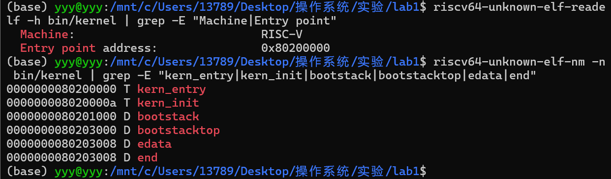

##### 2. `la sp, bootstacktop` 完成的操作及目的

`entry.S` 先在 `.data` 段中定义启动栈：

```asm
.align PGSHIFT
bootstack:
    .space KSTACKSIZE
bootstacktop:
```

`.space KSTACKSIZE` 在链接时预留实际栈空间；`la` 本身不分配栈，只把已经存在的 `bootstacktop` 地址装入栈指针 `sp`。实测符号地址为：

```text
bootstack    = 0x80201000
bootstacktop = 0x80203000
```

二者相差 `0x2000`，即 8192 字节。RISC-V 栈向低地址增长，因此初始 `sp` 应指向高地址端 `bootstacktop`。

反汇编中该伪指令展开为：

```asm
0x80200000: auipc sp,0x3
0x80200004: mv    sp,sp
```

第一条以当前 PC 为基准加 `0x3000`，得到 `0x80203000`；由于目标地址低12位偏移为0，第二条等价于 `addi sp,sp,0`，被反汇编器显示为 `mv sp,sp`。单步执行两条机器指令后：

```text
sp            = 0x80203000
&bootstacktop = 0x80203000
```

二者相等，证明内核已从 OpenSBI 的临时栈切换到自己的启动栈。设置栈是进入 C 代码的必要条件，因为函数调用、局部变量、保存返回地址和寄存器都依赖有效栈空间。

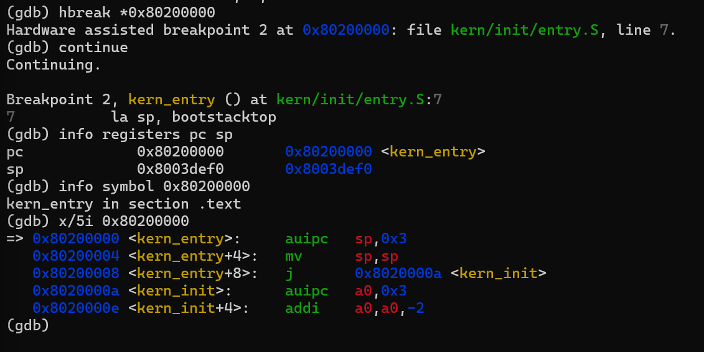

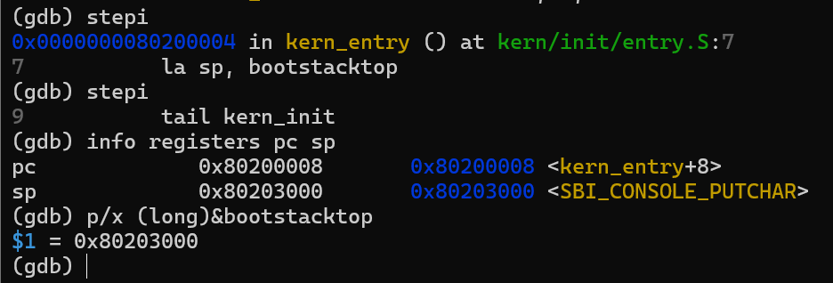

图中 GDB 在 `0x80203000` 后显示 `<SBI_CONSOLE_PUTCHAR>`，是因为另一个全局数据符号恰好与 `bootstacktop` 位于同一地址边界；`p/x (long)&bootstacktop` 已直接证明该地址确实是启动栈顶，并不表示栈指向输出函数。

##### 3. `tail kern_init` 完成的操作及目的

`tail` 是汇编器提供的尾调用伪指令。在当前距离范围内，它被展开为：

```asm
0x80200008: j 0x8020000a <kern_init>
```

执行前 PC 为 `0x80200008`，执行后 PC 变为 `0x8020000a`，控制权直接转交给 `kern_init()`。与普通 `call` 不同，`tail` 不把返回地址写入 `ra`，因为 `kern_entry` 后面没有需要继续执行的代码，`kern_init` 也被声明为 `noreturn`。这样既符合启动过程的单向控制流，也避免建立无意义的返回链路。

##### 4. `kern_init()` 的初始化行为

`kern_init()` 首先执行：

```c
memset(edata, 0, end - edata);
```

用于把需要零初始化的区域清零。当前最小内核实测：

```text
edata = 0x80203008
end   = 0x80203008
```

因此本次构建中清零长度为0，说明当前没有实际占用空间的未初始化全局数据。保留该代码是为了后续实验加入 BSS 数据后仍能正确初始化。

随后：

```c
cprintf("%s\n\n", message);
```

通过 `cprintf → vcprintf/vprintfmt → cons_putc → sbi_console_putchar → ecall → OpenSBI → QEMU串口` 输出启动信息。

最后：

```c
while (1)
    ;
```

被编译为：

```asm
0x8020003a: j 0x8020003a
```

该指令的当前地址与跳转目标相同，每次执行后 PC 仍为 `0x8020003a`，因此形成无限循环，防止内核入口函数返回到无效地址。

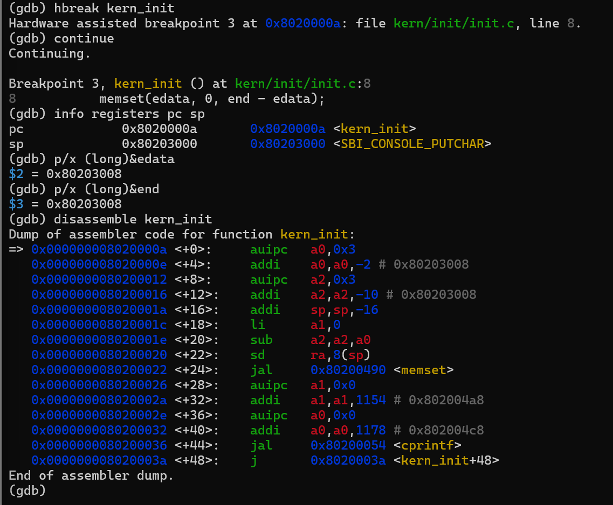

### 功能模块：构建流程、SBI 输出与 `cprintf`

**负责人：** 杨思远-2413636

#### 模块目标与代码范围

本模块阅读 `Makefile`、`tools/function.mk`、`tools/kernel.ld` 和 SBI/console/stdio 代码，说明源文件如何生成 RISC-V 内核及镜像，并追踪 `cprintf` 字符如何经 SBI 到达 QEMU 串口。B 提交的源码与本组当前代码逐文件校验一致；本次是阅读、构建和运行验证，没有修改内核源代码。

涉及函数包括：

```c
int kern_init(void);
int cprintf(const char *fmt, ...);
int vcprintf(const char *fmt, va_list ap);
void cons_putc(int c);
void sbi_console_putchar(unsigned char ch);
uint64_t sbi_call(uint64_t sbi_type, uint64_t arg0,
                  uint64_t arg1, uint64_t arg2);
```

#### Makefile、依赖规则与构建产物

`Makefile` 选择 `riscv64-unknown-elf-` 交叉工具链，并收集 `libs/` 与内核目录中的 `.c`、`.S` 文件。宿主机虽然是 x86-64 Ubuntu/WSL，编译目标仍是 RV64；`-nostdinc`、`-nostdlib` 避免错误依赖宿主机 C 运行库，`-mcmodel=medany` 适合链接到较高地址的内核代码，`-g` 保留 GDB 所需调试信息。`-ffunction-sections`、`-fdata-sections` 与链接选项 `--gc-sections` 配合，可按段丢弃未引用内容。

`tools/function.mk` 把源文件映射到 `obj/` 下的 `.o` 与 `.d`：依赖生成规则通过编译器 `-MM` 记录头文件依赖，编译规则通过 `-c` 生成对象文件；后续头文件变化会触发相应对象重编译。对象文件汇总后交给链接器。`tools/kernel.ld` 使用 `OUTPUT_ARCH(riscv)`、`ENTRY(kern_entry)` 和 `BASE_ADDRESS = 0x80200000` 布置 `.text`、只读数据、可写数据和 BSS 等段。

```text
.c/.S → obj/**/*.o（及头文件依赖 .d）
      → ld + tools/kernel.ld → bin/kernel（ELF64 RISC-V，可供符号检查/GDB）
      → objcopy --strip-all -O binary → bin/ucore.img（裸二进制镜像）
```

`bin/kernel` 是带 ELF 头、段表和调试符号的可执行文件；`bin/ucore.img` 是去除 ELF 容器信息后的裸字节镜像。B 的构建日志明确显示 `ld bin/kernel` 和 `riscv64-unknown-elf-objcopy ... bin/ucore.img` 均执行成功，`readelf` 检查得到 ELF64、Machine 为 RISC-V，入口地址为 `0x80200000`。

#### SBI 与 `cprintf` 字符输出链路

```text
kern_init()
  → cprintf()
  → vcprintf()
  → vprintfmt()
  → cputch()
  → cons_putc()
  → sbi_console_putchar()
  → sbi_call()
  → ecall
  → OpenSBI 提供的控制台服务
  → QEMU 虚拟串口 / -nographic 终端
```

`cprintf` 管理可变参数并调用 `vcprintf`；`vcprintf` 将格式串交给 `vprintfmt`，再由 `cputch` 逐字符输出。`cons_putc` 转发到 `sbi_console_putchar`。本代码使用 legacy SBI console putchar 调用号 1：`sbi_call` 把调用号放入 `a7/x17`、字符参数放入 `a0/x10`，执行 `ecall`。运行在 S-mode 的内核因此请求 M-mode 固件提供控制台服务，而不是直接调用宿主机的 `printf`。QEMU 的 `-nographic` 把虚拟串口连接到当前终端，所以可以看到 `(THU.CST) os is loading ...`。

#### 构建与运行记录

B 的交付环境为 WSL2 Ubuntu 22.04.5、`riscv64-unknown-elf-gcc 10.2.0`、QEMU 6.2.0、OpenSBI v0.9（运行时 SBI 0.2）。执行 `make clean && make` 后返回码为 0，生成 48,712 字节的 `bin/kernel` 和 12,296 字节的 `bin/ucore.img`。构建过程中出现 WSL 文件时间轻微超前的 `Clock skew detected` 警告，但没有编译或链接失败；ELF 入口为 `0x80200000`。

B 也验证了启动参数差异：压缩包的 `make qemu` 使用 `-device loader`，本机记录的 OpenSBI `Next Address` 为 `0x0`，观察不到内核输出；改用 `qemu-system-riscv64 -machine virt -nographic -bios default -kernel bin/kernel` 后，OpenSBI 报告 `Next Address = 0x80200000`，并输出内核字符串。内核随后按设计进入 `while (1)` 空转，因此 5 秒观察命令由 `timeout` 终止、返回码 124；这是观察时限结束，不是构建失败或内核崩溃。

B 的逐条构建与运行命令见 [B 部分运行记录](./B部分-完整运行记录.log)。新补充包还提供了 [GDB 启动跟踪日志](./B-GDB启动跟踪.log)、复现脚本及说明；日志由协作环境实测生成，不是 B 本人独立操作的证明，也没有对应的 B 个人截图。本报告的编译、QEMU 和 GDB 截图仍分别按团队已提交的 A/C 实测来源标注。

#### 提示词与实现迭代

**最终提示词（依据交付材料重建，并非原始对话逐字记录）：**

```markdown
[角色] 你是熟悉 RISC-V 内核构建、QEMU/OpenSBI 启动和 SBI 控制台输出的操作系统实验助教。
[材料] 阅读当前 Lab 1 的 Makefile、tools/function.mk、tools/kernel.ld、kern_init、printf/console/SBI 实现，并以 B 的完整运行日志、ELF 检查和 QEMU 输出为实测依据；未提供的信息标注“未记录”。
[任务] 说明 .c/.S 到 .o、bin/kernel 和 bin/ucore.img 的构建链；解释关键编译/链接规则及 ELF 与裸镜像的区别；追踪 cprintf 经 ecall、OpenSBI 到 QEMU 虚拟串口的输出链；对比 make qemu 的 -device loader 与 -kernel bin/kernel 的实际启动结果，并依据 OpenSBI Next Address 和内核字符串判断是否进入内核。
[迭代与测试] 将 Clock skew 警告、成功退出码和 timeout 返回码 124 分开解释；结合实际日志说明每轮验证、发现的问题和解决方式，不把观察超时说成崩溃。
[输出] 按模板给出模块目标、涉及文件/函数、分析过程、测试结果、截图/日志证据和答辩要点。区分源码事实、日志实测和原理解释。
[约束] 不修改内核代码；不虚构原始 AI 对话、工具版本、截图或未运行的测试；A/C 截图不得标成 B 的个人截图；报告与日志不一致时指出差异。
```

完整结构化提示词见 [`prompt.md`](./prompt.md) 中的“提示词 10”。B 的原始 AI 对话没有随压缩包提供，因此正文和提示词文件都明确标注为依据交付内容重建的归纳稿，而不是逐字记录。

**工作迭代复盘：** B 没有修改内核代码；以下迭代描述实际分析和验证步骤，不代表代码生成/修复，也不声称还原 AI 对话轮次。

##### 第一次迭代：梳理构建规则

**完成内容：** 阅读 `Makefile`、`tools/function.mk` 和 `tools/kernel.ld`，整理 `.c/.S → .o/.d → bin/kernel → bin/ucore.img` 的构建链，并在运行日志中核对 `ld`、`objcopy` 命令。

**遇到的问题：** 仅看规则文件不能证明构建产物确实生成。

**解决策略：** 继续执行清理构建，并使用日志、文件大小和 ELF 信息交叉验证。

**阶段结果：** 构建步骤及 ELF 和裸镜像的用途明确。

##### 第二次迭代：清理构建与 ELF 检查

**完成内容：** 执行 `make clean && make`；日志返回码为 0，生成 48,712 字节的 `bin/kernel` 和 12,296 字节的 `bin/ucore.img`。`readelf` 确认 ELF64 RISC-V，入口为 `0x80200000`。

**遇到的问题：** 构建日志出现 `Clock skew detected` 警告。

**解决策略：** 结合成功退出码、生成产物和 ELF 检查判断；该提示是文件时间戳警告，不是编译或链接失败。

**阶段结果：** 编译、链接和镜像生成通过。

##### 第三次迭代：对比 QEMU 启动参数

**完成内容：** 先记录课程 `make qemu` 路径的 OpenSBI `Next Address=0x0`，再用 `-kernel bin/kernel` 对照；后一条路径报告下一阶段地址 `0x80200000` 并输出内核启动字符串。

**遇到的问题：** 原启动参数没有提供有效的下一阶段入口，内核没有开始执行。

**解决策略：** 保留源码，改用 QEMU 的 `-kernel` 参数加载 ELF，让 QEMU 识别 ELF 入口。

**阶段结果：** 对照结果支持这是启动参数兼容问题；显式指定入口后内核能够启动。

##### 第四次迭代：核验 SBI 输出和运行结束状态

**完成内容：** 从源码追踪 `cprintf` 到 `ecall`/OpenSBI，并在 QEMU 终端观察到 `(THU.CST) os is loading ...`。

**遇到的问题：** 内核进入 `while (1)` 后不会主动退出，5 秒观察命令最终返回 124。

**解决策略：** 将源码中的无限循环、已出现的启动字符串和 `timeout` 的观察时限一起判断；不把 124 当作内核崩溃。

**阶段结果：** SBI 输出链路有效；124 表示观察时限结束。

**关键改进点：** 提示词明确指定 B 的源码和日志作为材料；要求逐项区分源码事实、日志实测和原理解释；补充 `Next Address` 对照、警告与超时的判读规则；要求没有原始记录的版本、截图和 AI 对话保持未记录状态。

逐条构建、运行命令见 [B 部分完整运行记录](./B部分-完整运行记录.log)。新 GDB 日志在下方共同调试部分引用，并注明其来源和适用范围。

---

### 共同实操：练习2——使用GDB验证启动流程

以下启动链由 A 的 GDB 记录、C 的本机复测，以及 B 新补充包中的协作环境 GDB 跟踪日志共同支持。补充日志记录了复位状态、进入 `kern_entry`、设置启动栈和命中 `kern_init`；它没有在 `0x80000000` 设置断点，也不代表 B 本人完成了独立调试。OpenSBI 阶段仍以 A/C 的调试材料为证。全组答辩前应能共同讲解这些断点和寄存器结果。

补充日志中，GDB 初始状态为 `pc=0x1000, sp=0`；命中 `kern_entry` 时为 `pc=0x80200000, sp=0x80017ee0`；执行 `la sp, bootstacktop` 展开的两条指令后，`sp` 变为 `0x80203000`；随后命中 `kern_init` 时 `sp` 保持不变。完整原始输出见 [B-GDB启动跟踪日志](./B-GDB启动跟踪.log)。

#### 1. QEMU调试服务器

QEMU 参数 `-s` 等价于 `-gdb tcp::1234`，在本机1234端口开放 GDB Server；`-S` 在启动时冻结虚拟 CPU。GDB 使用：

```gdb
target remote localhost:1234
```

连接后读取当前寄存器，观察到复位 PC 为 `0x1000`、`sp=0`。

#### 2. 复位ROM `0x1000`

```asm
0x1000: auipc t0,0x0
0x1004: addi  a2,t0,40
0x1008: csrr  a0,mhartid
0x100c: ld    a1,32(t0)
0x1010: ld    t0,24(t0)
0x1014: jr    t0
```

该代码由 QEMU `virt` 机器提供，不属于 uCore 源码。它读取 HART ID 和启动参数，从复位ROM数据区取得 OpenSBI 入口地址，并通过 `jr t0` 跳转到 `0x80000000`。

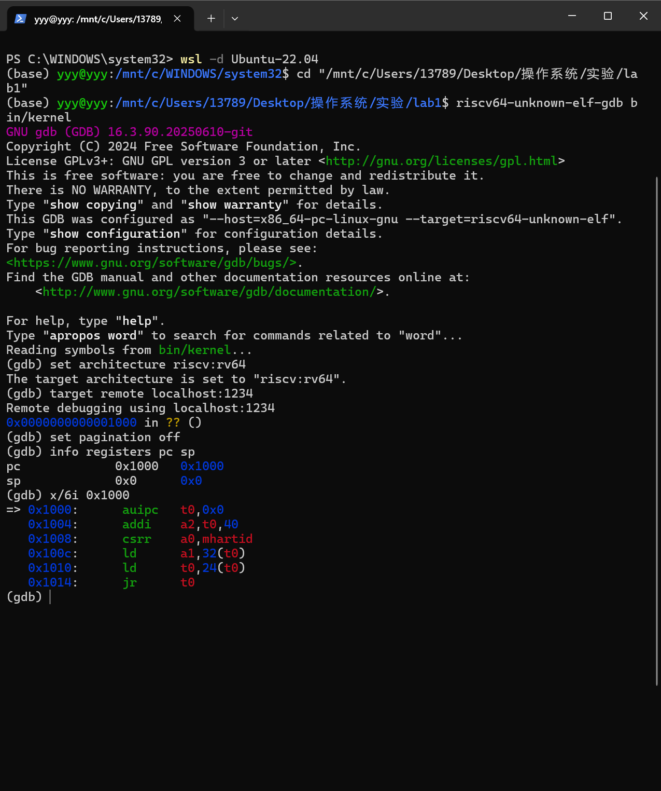

#### 3. OpenSBI入口 `0x80000000`

在 `0x80000000` 设置断点后，CPU成功停在 OpenSBI 首条指令，`pc=0x80000000`、`sp=0`。这说明系统仍处于固件最早期阶段，后续由 OpenSBI 建立运行环境并把内核作为下一阶段程序启动。

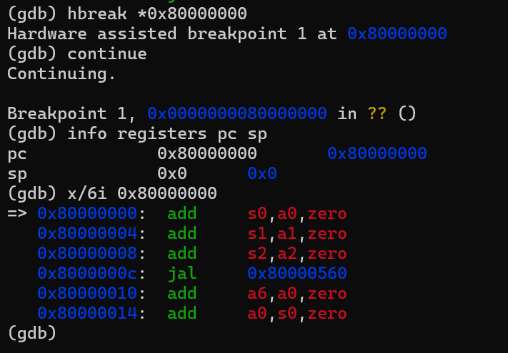

#### 4. 内核入口 `0x80200000`

继续执行后命中 `0x80200000 <kern_entry>`，证明 OpenSBI 的下一阶段地址、链接脚本入口和实际控制流三者一致。随后单步验证启动栈设置，并继续命中 `kern_init` 与 `cprintf`。

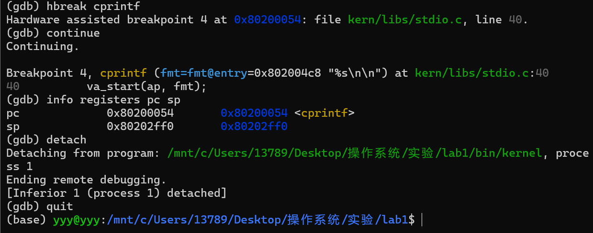

GDB执行 `detach` 后，虚拟CPU继续运行，QEMU终端成功输出启动字符串。

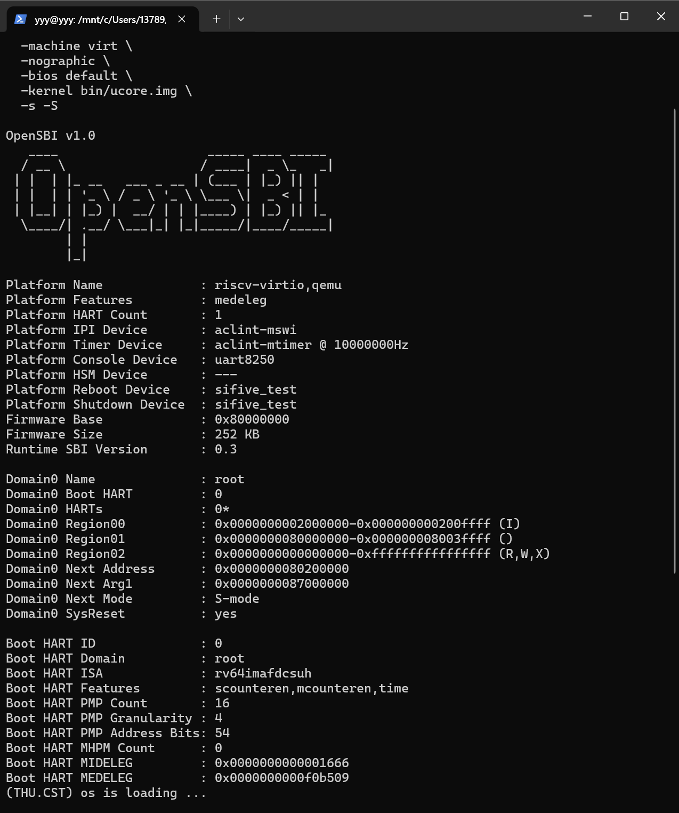

---

### 成员 C 的复测与证据

**负责人：** 王优-2413681

C 在 WSL2 Ubuntu 22.04.5、GCC 10.2.0、QEMU 6.2.0 和 GDB 12.1 环境中重复验证。调试时使用 `-kernel bin/ucore.img -S -s` 启动 QEMU，并在另一个终端加载 `bin/kernel` 的符号。

实测顺序与 A 的结果一致：GDB 初始 `pc=0x1000`；执行六条复位代码后到达 `0x80000000`；设置 `break *0x80200000` 后停在 `kern_entry`；入口单步后 `sp=0x80203000`；随后命中 `kern_init`。QEMU 串口显示 `(THU.CST) os is loading ...`。内核进入 `while (1)` 后持续运行是预期现象。

C 环境的 `cprintf` 符号为 `0x80200056`，与 A 环境记录的 `0x80200054` 不同；这是编译环境差异，报告未将其合并为一个地址。当前启动参数使用 `-kernel`，镜像在 CPU 开始执行前由 QEMU 放入内存，因此 GDB 的 `watch *0x80200000` 不会捕捉这次预加载；C 以入口断点验证控制流交接。

**图 C-1：C 从复位地址跟踪至 OpenSBI、内核入口，并单步观察 SP。**

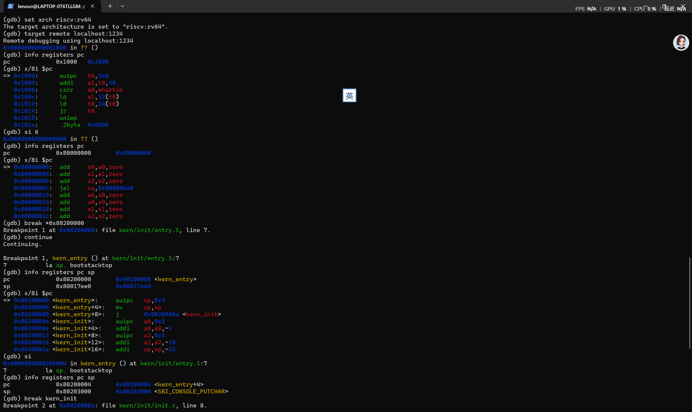

**图 C-2：C 命中 `kern_init` 断点。**

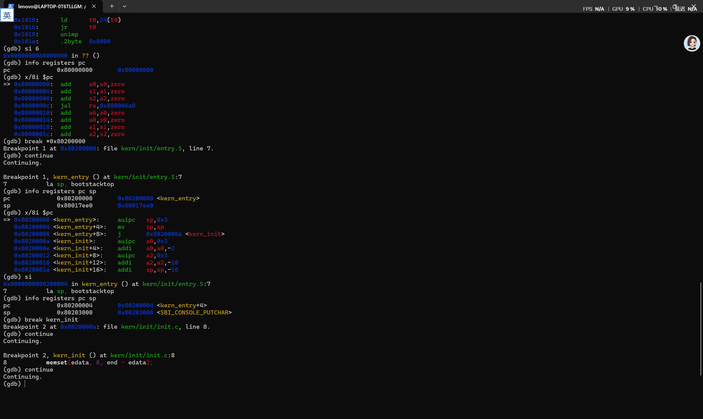

**图 C-3：C  QEMU/OpenSBI 信息和内核启动输出。**该终端滚屏包含前一次 QEMU 退出记录，内核启动信息来自实际运行。

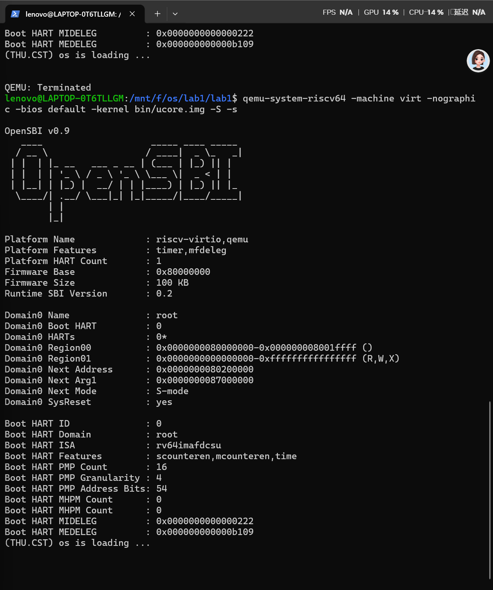

---

## 五、测试与验证

### 5.1 编译与镜像生成

A、B、C 的记录均显示构建成功。B 的完整命令输出见 [B 部分运行记录](./B部分-完整运行记录.log)；A 的构建截图如下。成员日志中的文件大小和符号布局有差异，报告按各自日志分别记录，不将差异简单归因于单一工具版本。

执行：

```bash
make clean
make
ls -lh bin
```

实际生成：

```text
bin/kernel     44K
bin/ucore.img  13K
```

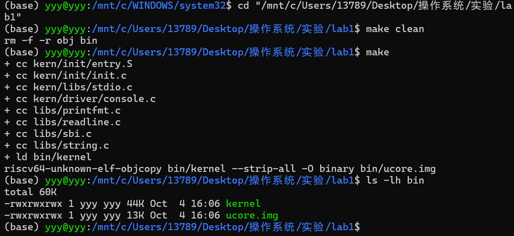

### 5.2 正常启动验证

A 的 QEMU 7.0.0 运行截图和 C 的 QEMU 6.2.0 复测均使用裸镜像启动：

```bash
qemu-system-riscv64 \
  -machine virt \
  -nographic \
  -bios default \
  -kernel bin/ucore.img
```

OpenSBI显示：

```text
Firmware Base        : 0x80000000
Domain0 Next Address : 0x80200000
Domain0 Next Mode    : S-mode
```

内核最终输出：

```text
(THU.CST) os is loading ...
```

B 的 QEMU 6.2.0 日志则使用 `-kernel bin/kernel` 加载 ELF，同样观察到 `Next Address=0x80200000` 和内核输出，命令与原始输出见 B 部分运行记录。

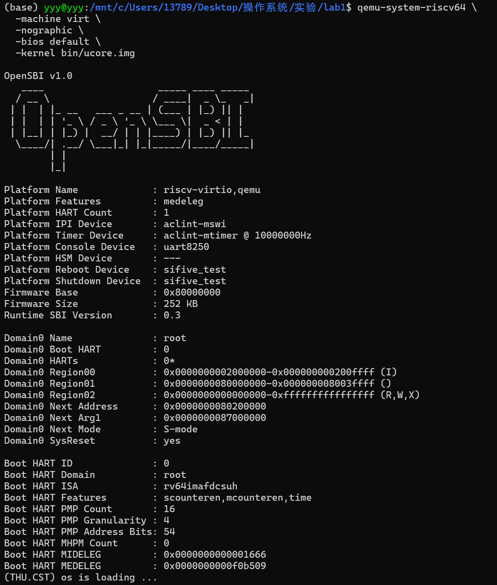

### 5.3 关键检查点汇总

| 检查项              | 预期结果                             | 实测结果                                                                    | 状态    |
| ---------------- | -------------------------------- | ----------------------------------------------------------------------- | ----- |
| 编译和链接            | 生成 `bin/kernel`                  | A：约44K；B：48,712字节；B日志返回码0                                               | 通过    |
| 镜像生成             | 生成 `bin/ucore.img`               | A：约13K；B：12,296字节；B日志返回码0                                               | 通过    |
| ELF架构            | RISC-V 64位                       | `Machine: RISC-V`                                                       | 通过    |
| ELF入口            | `0x80200000`                     | A/B/C 的构建/检查记录均为 `0x80200000`                                           | 通过    |
| CPU复位入口          | `0x1000`                         | `pc=0x1000`                                                             | 通过    |
| OpenSBI入口        | `0x80000000`                     | `pc=0x80000000`                                                         | 通过    |
| uCore入口          | `0x80200000`                     | `pc=0x80200000 <kern_entry>`                                            | 通过    |
| 内核启动栈            | `sp=bootstacktop`                | 均为 `0x80203000`                                                         | 通过    |
| C语言入口            | 进入 `kern_init`                   | `pc=0x8020000a`                                                         | 通过    |
| B补充GDB跟踪         | 观察复位、内核入口、栈设置和 `kern_init`       | `B-GDB启动跟踪.log`：`0x1000 → 0x80200000 → 0x8020000a`；由协作环境实测，不作为 B 个人操作证明 | 补充证据  |
| BSS边界            | 可由链接符号确定                         | `edata=end=0x80203008`                                                  | 通过    |
| 格式化输出            | 命中 `cprintf` / 确认 SBI 输出         | A：`cprintf=0x80200054`；C：`0x80200056`；B：QEMU 串口出现启动字符串                  | 通过    |
| `make qemu` 原始目标 | OpenSBI 下一跳为内核入口                 | B 日志 `Next Address=0x0`，未出现内核输出                                         | 需兼容参数 |
| 显式 `-kernel` 启动  | OpenSBI 下一跳 `0x80200000` 并出现内核输出 | A/C 加载裸镜像；B 加载 ELF；日志/截图均见报告                                            | 通过    |
| 启动信息             | 输出指定字符串                          | `(THU.CST) os is loading ...`                                           | 通过    |

当前代码包未提供 `tools/grade.sh`，因此通用报告模板中的 `make grade` 在本实验目录不可用。本实验以编译成功、ELF/符号检查、QEMU启动输出和GDB关键地址链作为验收证据。

---

## 六、实验总结与收获

### 6.1 对操作系统的理解

| 实验知识点                              | 对应OS原理      | 含义、关系与差异                                                   |
| ---------------------------------- | ----------- | ---------------------------------------------------------- |
| QEMU复位入口 `0x1000`                  | CPU复位与启动向量  | 复位PC由硬件平台规定；本实验中该“硬件”由QEMU实现，因此地址不在uCore源码中                |
| OpenSBI `0x80000000`               | 固件与特权级      | OpenSBI运行在更高特权级，完成早期初始化并为S-mode内核提供SBI服务                   |
| `ENTRY(kern_entry)` 与 `0x80200000` | 程序装载与地址空间布局 | 链接地址、加载地址和跳转地址必须一致，否则CPU不能按预期解释代码中的地址                      |
| `la sp,bootstacktop`               | 函数调用栈       | 在进入C函数前建立内核自己的栈，使局部变量、返回地址和寄存器保存具有可靠空间                     |
| `tail kern_init`                   | 控制权移交与尾调用   | 启动过程是单向的，内核入口不需要返回，因此不建立无意义的返回链路                           |
| BSS清零                              | C语言运行时约定    | 未显式初始化的全局变量必须从0开始；裸机内核需要自己完成这一步                            |
| SBI字符输出                            | 内核与固件接口     | uCore不调用宿主Windows/Linux的输出函数，而是通过 `ecall` 请求OpenSBI和虚拟串口输出 |
| GDB远程调试                            | 内核可观测性      | 软件调试器可以暂停虚拟CPU、读取寄存器和反汇编，验证仅靠最终输出无法证明的启动细节                 |

### 6.2 AI协作开发的经验

本实验中AI的主要作用不是生成代码，而是帮助建立“源码—编译产物—运行现象—调试证据”的对应关系。实践中得到以下经验：

1. 对AI给出的启动结论必须使用当前环境验证。例如原Makefile面向较老QEMU，当前QEMU 7.0.0的行为不同，只有检查OpenSBI的 `Next Address` 才能发现兼容问题。
2. 提问时需要提供具体文件、命令输出和地址，避免只问“为什么运行不了”。当输入包含Makefile、QEMU版本和OpenSBI输出时，才能把环境兼容问题与代码错误区分开。
3. AI可以解释伪指令和反汇编，但最终应由GDB的寄存器结果验证。例如 `sp=bootstacktop=0x80203000` 比单纯复述 `la` 的定义更有说服力。
4. 报告中的每个结论都应对应实际截图或源码证据，不引用其他年份Lab1中断实验、不同地址布局或未执行的测试结果。

通过本实验，我们完成了从源代码到内核镜像、从CPU复位到C语言入口及 SBI 字符输出的观察，建立了后续操作系统实验所需的编译、运行和调试基础。新补充的 GDB 日志可用于复习和复现；如果课程要求每位成员证明本人独立调试，杨思远仍需在自己的 WSL 终端亲自复跑并保存个人记录。
